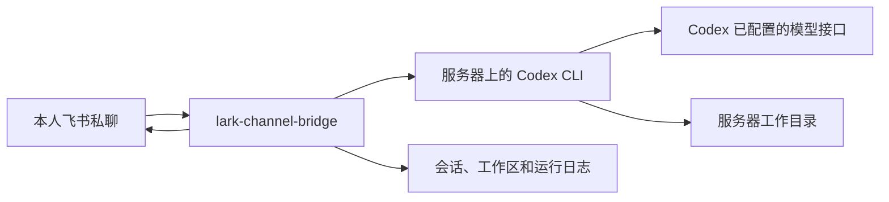

# 使用 lark-channel-bridge 在阿里云 ECS 上运行 Codex 飞书个人助手

> 一份面向个人服务器的公开教程：复用服务器上已经配置好的 Codex CLI，通过飞书长连接远程使用 Codex。

- 运行组件：`lark-channel-bridge`、Codex CLI、Node.js
- 飞书连接：长连接，不需要公网回调端口
- 使用范围：服务器所有者本人
- 安装方式：服务器直接联网安装，不使用本机下载、SSH 上传或离线安装包

本文已经移除真实服务器地址、账号、App Secret、API Key、token、`open_id`、设备码和日志。所有 `<YOUR_...>` 都是占位符。

## 1. 方案定位

`lark-channel-bridge` 是一个开源桥接程序，把飞书消息转给本机的 Claude Code 或 Codex CLI，再把运行过程和最终结果发回飞书。它已经提供了本方案原本准备自己编写的主要能力：

- 飞书私聊和群聊接入；
- WebSocket 长连接；
- Codex CLI 启动和输出转发；
- 按聊天保存连续会话；
- 消息排队和批处理；
- `/new`、`/resume`、`/stop`、`/status` 等命令；
- 工作目录和多个工作区切换；
- 飞书卡片和流式进度显示；
- Linux systemd 用户服务；
- 个人用户、群聊和管理员访问控制。

它不是 OpenAI Codex 或飞书官方软件包。它的 GitHub 仓库名是 [`zarazhangrui/lark-coding-agent-bridge`](https://github.com/zarazhangrui/lark-coding-agent-bridge)，npm 包名是 `lark-channel-bridge`。

当前仓库只保存本教程，不包含自研的 `gateway.py`、`codex_runner.py` 或 `admin_helper.py`。本方案不再创建这些程序。

### 1.1 工作链路



### 1.2 与自研方案的区别

| 项目 | 本方案 |
| --- | --- |
| 消息网关 | 使用 `lark-channel-bridge`，不自己写 |
| Codex 配置 | 使用当前用户已有的 `~/.codex/config.toml` 和 `auth.json` |
| Linux 账号 | 使用服务器当前个人账号，不创建专用服务账号 |
| 权限模式 | 个人服务器可以使用 bridge 的 `full` 模式；不额外设计管理员执行器 |
| 任务控制 | 使用 bridge 自带的会话、队列和飞书命令 |
| systemd | 使用 bridge 的 `start/status/stop` 管理命令，不自己写 unit |
| 飞书认证 | 使用 bridge 的 PersonalAgent 配置和 profile 状态 |

## 2. 个人服务器的边界

服务器和飞书机器人都由同一个人使用，因此不需要专用 Linux 账号或复杂的跨账号隔离。但这不等于可以把机器人开放给其他人：

- 默认只允许应用创建者使用私聊和群聊；
- 不执行 `/invite user`、`/invite group` 或 `/invite all group`；
- 不把机器人加入不受自己控制的群；
- 不把 bridge 管理端页面、公网端口或 SSH 凭证暴露给其他人；
- Codex 可能拥有当前账号能访问的文件和命令权限，启动前确认工作目录和服务器数据范围。

个人服务器可以选择 bridge 的 `full` 权限模式，以便 Codex 完成文件修改、安装依赖和运行测试；代价是模型或飞书消息中的错误指令可能直接影响当前账号能访问的内容。需要多人使用、对外开放或接触生产数据时，应重新设计账号和权限边界。

## 3. 准备条件

| 项目 | 要求 |
| --- | --- |
| 系统 | Ubuntu 24.04 LTS、x86_64 Linux |
| Node.js | `>=20.12.0`；由 Ubuntu 软件源或组织批准的 APT 源提供 |
| Codex CLI | 已安装、已登录，并且 `codex exec` 已经成功测试 |
| 飞书 | 一个 PersonalAgent 应用，或允许 bridge 首次启动时创建 |
| 网络 | 服务器能够访问 npm registry、飞书 API 和 Codex 配置中的模型接口 |
| 入站端口 | 不需要为 bridge 新增公网 HTTP 回调端口 |

公开文档中不要写入真实 ECS 公网 IP。需要说明连接目标时使用占位符：

```bash
export DEPLOY_HOST="<YOUR_ECS_HOSTNAME_OR_IP>"
export DEPLOY_USER="<YOUR_SERVER_USER>"
ssh "${DEPLOY_USER}@${DEPLOY_HOST}" 'uname -a'
```

## 4. 服务器直接联网安装

本节命令在目标服务器上执行。命令按实际部署顺序编排，公开示例不包含真实服务器地址、主机名和认证信息。

### 4.1 安装系统依赖

先检查服务器是否已经有符合要求的 Node.js：

```bash
node --version
npm --version
```

如果没有安装，或者 Node.js 低于 `20.12.0`，使用可信 Node.js APT 源直接联网安装。下面以 Node.js 22 LTS 为例：

```bash
set -eu

export NODE_MAJOR="22"

sudo apt-get update
sudo apt-get install -y ca-certificates curl gnupg jq
sudo install -d -m 0755 /etc/apt/keyrings
curl -fsSL https://deb.nodesource.com/gpgkey/nodesource-repo.gpg.key \
  | sudo gpg --dearmor --yes -o /etc/apt/keyrings/nodesource.gpg
echo "deb [signed-by=/etc/apt/keyrings/nodesource.gpg] https://deb.nodesource.com/node_${NODE_MAJOR}.x nodistro main" \
  | sudo tee /etc/apt/sources.list.d/nodesource.list >/dev/null
sudo apt-get update
sudo apt-get install -y nodejs

node --version
npm --version
```

不要直接使用 Ubuntu 24.04 默认仓库中可能低于要求的 Node.js，也不要通过本机下载、上传或手工解压归档解决。

### 4.2 安装 lark-channel-bridge

为了便于回退，先查看 npm registry 中的当前版本，再将经过确认的版本写入变量。本次实操使用 `0.7.0`：

```bash
npm view lark-channel-bridge version
export BRIDGE_VERSION="0.7.0"
```

直接从可信 npm registry 安装固定版本：

```bash
sudo npm install --global \
  --registry="https://registry.npmjs.org" \
  --no-audit --no-fund --loglevel=warn \
  "lark-channel-bridge@${BRIDGE_VERSION}"

if ! command -v lark-channel-bridge >/dev/null 2>&1; then
  bridge_bin="$(npm config get prefix)/bin/lark-channel-bridge"
  test -x "${bridge_bin}"
  test ! -e /usr/local/bin/lark-channel-bridge
  sudo ln -s "${bridge_bin}" /usr/local/bin/lark-channel-bridge
fi

lark-channel-bridge --version
lark-channel-bridge --help
```

正常安装后应直接找到 `lark-channel-bridge`。上面的 `if` 只处理“npm 已经安装成功，但 npm 全局 `bin` 目录不在 `PATH`”的情况；如果 `/usr/local/bin/lark-channel-bridge` 已经存在，不要覆盖，先检查它指向的版本。

如果所在网络不能访问官方 registry，再将 `--registry` 替换为组织批准的可信镜像。不要使用未知镜像，也不要把 API Key、App Secret 或模型地址写入 npm 命令参数。

### 4.3 不需要安装的组件

本方案不需要再安装或编写：

- Python 网关；
- SQLite 任务队列；
- 自定义 `codex_runner.py`；
- 自定义管理员执行器；
- 自定义 systemd unit；
- 离线安装包、SSH 上传脚本或本机打包目录。

## 5. 复用服务器已有的 Codex 配置

### 5.1 配置位置

Codex CLI 使用自己的用户目录，不需要项目 `.env`：

```text
~/.codex/
  config.toml       # 模型、提供方、沙箱和审批策略
  auth.json         # Codex 登录状态
  sessions/         # 由 CLI 版本管理的会话数据
```

bridge 在同一个服务器用户下启动 `codex`，因此应直接复用该用户已经成功验证的 Codex 配置和登录状态。不要把 `auth.json` 复制到仓库、飞书消息或其他用户目录。

检查时只输出状态，不打印文件内容：

```bash
codex --version
codex login status
stat -c '%a %U %G %n' \
  "$HOME/.codex/config.toml" \
  "$HOME/.codex/auth.json"
```

认证文件至少应只有当前用户可读写：

```bash
chmod 600 "$HOME/.codex/config.toml" "$HOME/.codex/auth.json"
```

### 5.2 模型调用验收

如果服务器已经通过以下命令验证成功，就不需要为 bridge 再设计一套 `.env`：

```bash
codex exec \
  --skip-git-repo-check \
  --sandbox read-only \
  --json \
  '请只回复：OK' \
  </dev/null
```

正常情况下 JSONL 会出现 `thread.started`、`turn.started`、`item.completed` 和 `turn.completed`。bridge 只负责把飞书消息交给本机 Codex CLI，不替换 Codex 的模型配置。

## 6. 首次绑定飞书

### 6.1 创建工作目录和 Codex profile

先创建一个明确的默认工作目录，再创建名为 `codex` 的 profile：

```bash
export BRIDGE_PROFILE="codex"
export BRIDGE_WORKSPACE="${HOME}/codex-workspace"

install -d -m 700 "${BRIDGE_WORKSPACE}"
lark-channel-bridge profile create "${BRIDGE_PROFILE}" \
  --agent codex \
  --workspace "${BRIDGE_WORKSPACE}"
```

向导会在终端展示二维码和一次性授权链接。使用飞书移动端完成 PersonalAgent 创建和绑定，等待终端明确显示成功后再继续。不要把二维码、授权链接或其中的用户码保存到文档和公开日志。

如果已经有 PersonalAgent 应用，可以传入 App ID：

```bash
lark-channel-bridge profile create "${BRIDGE_PROFILE}" \
  --agent codex \
  --workspace "${BRIDGE_WORKSPACE}" \
  --app-id "<YOUR_FEISHU_APP_ID>"
```

App Secret 按提示输入，不要直接写在命令行、shell 历史或文档中。

绑定完成后，激活并检查 profile：

```bash
lark-channel-bridge profile use "${BRIDGE_PROFILE}"
lark-channel-bridge profile list
```

### 6.2 前台启动验证

先保持前台运行，观察连接状态：

```bash
lark-channel-bridge run --profile "${BRIDGE_PROFILE}"
```

在飞书中向机器人发送 `/status`，再发送一个简单问题，确认 bridge 能收到消息、Codex 能执行并且飞书能收到回复。验证成功后按 `Ctrl-C` 停止前台进程，再安装后台服务。

每个 profile 分别保存应用凭证、会话、工作目录、日志和自己的 `lark-cli` 状态。服务器全局执行的 `lark-cli auth login` 不会自动复制到 bridge profile；bridge 的基本收发消息只需要完成 PersonalAgent 绑定。

### 6.3 飞书应用的必要设置

如果二维码向导没有自动完成应用设置，在飞书开发者后台核对：

1. 已启用机器人或 PersonalAgent 能力；
2. 已发布应用版本；
3. 已允许接收私聊消息和发送机器人回复；
4. 事件订阅使用长连接，事件包含 `im.message.receive_v1`；
5. 应用可用范围没有误扩大到其他人员。

不要为 bridge 配置公网回调 URL，也不需要新增 HTTP 监听端口。

### 6.4 可选：为 bridge profile 授权飞书用户身份

PersonalAgent 绑定完成后，bridge profile 默认使用应用身份，飞书中的 `/status` 会显示 `lark-cli: app`。这已经足够接收消息和调用 Codex；但应用身份不能直接访问当前用户自己的云文档、云盘、日历等资源。

如果需要让 bridge 启动的 Codex 通过 `lark-cli` 访问个人飞书资源，应在 profile 自己的飞书 CLI 配置目录中完成用户授权：

```bash
export BRIDGE_PROFILE="codex"
export BRIDGE_LARK_CLI_DIR="${HOME}/.lark-channel/profiles/${BRIDGE_PROFILE}/lark-cli/lark-channel"

LARKSUITE_CLI_CONFIG_DIR="${BRIDGE_LARK_CLI_DIR}" \
  lark-cli auth login --domain all --no-wait --json
```

命令会输出一次性的 `verification_url` 和 `device_code`。在自己的电脑上打开原样的 `verification_url` 完成授权，然后在同一个 profile 配置目录中完成登录并检查状态：

```bash
LARKSUITE_CLI_CONFIG_DIR="${BRIDGE_LARK_CLI_DIR}" \
  lark-cli auth login --device-code "<DEVICE_CODE>"

LARKSUITE_CLI_CONFIG_DIR="${BRIDGE_LARK_CLI_DIR}" \
  lark-cli auth status --json --verify
```

授权完成后，在飞书中发送 `/config`，把当前 profile 的 lark-cli 身份策略切换为 `user-default`，再用 `/status` 确认显示 `lark-cli: user-ready`。如果只需要 bridge 收发消息，保持默认的 `bot-only` 和 `lark-cli: app` 即可。

### 6.5 可选：使用服务器全局飞书 CLI 登录当前用户

`lark-cli auth login` 是服务器全局飞书 CLI 的用户授权流程，不是 `lark-channel-bridge` 的必需步骤。只有在服务器终端中还要直接使用 `lark-cli` 访问飞书文档、云盘等个人资源时，才执行下面的命令。

首次使用飞书 CLI 时先初始化。这个命令会持续等待浏览器确认；保持 SSH 终端开启，打开终端输出的原始授权链接并完成配置：

```bash
lark-cli config init --new
```

初始化完成后再发起用户登录。远程服务器通常没有图形浏览器，因此使用分步授权：

```bash
# 按实际需要选择业务域；不需要时不要申请 all
lark-cli auth login --domain docs --domain drive --no-wait --json
```

命令会输出一次性的 `verification_url` 和 `device_code`。在自己的电脑上打开原样的 `verification_url` 完成飞书授权，然后回到服务器执行：

```bash
lark-cli auth login --device-code "<DEVICE_CODE>"
lark-cli auth status --json --verify
lark-cli whoami
```

如果确实需要一次申请全部业务域，可以把登录命令改为 `lark-cli auth login --domain all --no-wait --json`。认证输出中的 URL、设备码、token 和身份信息只用于本次操作，不要粘贴到公开 issue、日志或 GitHub 仓库。

服务器全局登录和第 6.4 节的 bridge profile 登录相互独立，不要因为全局 `auth status` 成功，就认为飞书中的 `/status` 一定会显示 `user-ready`。

## 7. 个人使用的聊天命令

bridge 已经提供常用控制命令，不需要在代码中定义中文关键词：

| 命令 | 作用 |
| --- | --- |
| `/new` 或 `/reset` | 新建当前聊天会话 |
| `/resume` | 恢复兼容的历史会话 |
| `/status` | 查看 profile、工作目录、会话和运行状态 |
| `/stop` | 停止当前 Codex 任务 |
| `/cd <路径>` | 切换当前工作目录并重置会话 |
| `/ws list` | 查看已保存的工作区 |
| `/ws save <名称>` | 保存当前工作目录 |
| `/ws use <名称>` | 切换到已保存的工作区 |
| `/help` | 查看 bridge 帮助卡片 |

个人使用时不需要执行 `/invite`。默认只有 PersonalAgent 创建者可以使用机器人，其他人的私聊会被忽略。

### 7.1 连续会话和排队

bridge 按聊天、话题或文档评论线程保存 Codex 会话。短时间内连续发送的消息会合并；Codex 运行期间的新消息会进入下一轮；`/stop` 等控制命令可以中断当前任务。

如果希望每次长时间闲置后自动开始新会话，可以在对应 profile 中设置空闲时间；旧会话仍保留，可用 `/resume` 或历史命令继续。

### 7.2 工作目录

先用 `/status` 确认当前目录，再用 `/cd` 或工作区命令切换。不要把 `/`、整个 home 目录、系统目录或包含大量私人资料的目录设为工作区。

工作目录只是 Codex 当前运行位置，不等于 Linux 文件系统隔离。个人服务器使用 `full` 权限时，Codex 仍可能访问当前用户拥有权限的其他文件。

## 8. 个人权限模式

bridge 会把权限模式转换为 Codex 的执行模式。个人服务器可以按实际需求选择：

| bridge 模式 | 适用场景 |
| --- | --- |
| `read-only` | 只查看文件和生成方案 |
| `workspace` | 允许修改当前工作区 |
| `full` | 个人服务器的日常使用，允许完成完整任务 |

个人方案可以使用 `full`，但需要明确接受它的含义：删除文件、安装依赖、运行命令和修改系统都可能直接发生，不会由本文再加一层自研审批器。

不要使用 `yolo`，除非你已经理解它会进一步绕过 Codex 的安全确认和沙箱。无论选择哪种模式，都不要把机器人开放给其他人或不受控制的群聊。

## 9. 安装后台服务

前台运行确认成功后，用 bridge 自带的服务命令：

```bash
export BRIDGE_PROFILE="codex"

lark-channel-bridge start --profile "${BRIDGE_PROFILE}"
lark-channel-bridge status --profile "${BRIDGE_PROFILE}"
```

Linux 下 bridge 会创建当前用户的 systemd 用户服务。常用管理命令：

```bash
lark-channel-bridge restart --profile "${BRIDGE_PROFILE}"
lark-channel-bridge stop --profile "${BRIDGE_PROFILE}"
lark-channel-bridge status --profile "${BRIDGE_PROFILE}"
```

为了让用户级 systemd 服务在退出 SSH 后和服务器重启后仍能运行，为当前个人账号启用 linger：

```bash
sudo loginctl enable-linger "$(id -un)"
loginctl show-user "$(id -un)" -p Linger --value
systemctl --user is-enabled "lark-channel-bridge.bot.${BRIDGE_PROFILE}.service"
systemctl --user is-active "lark-channel-bridge.bot.${BRIDGE_PROFILE}.service"
```

预期依次看到 `yes`、`enabled` 和 `active`。这不是新增专用账号，只是保证当前个人账号的用户服务能够随系统启动。

不要手工创建 `codex-feishu-agent.service`，也不要再写 `gateway.py` 的 `ExecStart`。如果系统重启后用户服务没有启动，应检查当前用户的 systemd 用户会话和 bridge 自带服务状态，而不是复制一份 root system service。

## 10. 文件和日志位置

bridge 的实际目录由 `LARK_CHANNEL_HOME` 和 profile 配置决定，默认在当前用户 home 下：

```text
~/.lark-channel/
  config.json                         # profile 和当前选项
  active-profile                      # 当前 profile
  profiles/<profile>/
    sessions.json                     # 会话状态
    workspaces.json                   # 工作区绑定
    secrets.enc                       # profile 凭证
    lark-cli/                         # profile 专用飞书 CLI 状态
    media/                            # 附件缓存
    logs/                             # 结构化运行日志
```

不要提交 `~/.lark-channel`、`secrets.enc`、会话、附件或日志。可以通过 `LARK_CHANNEL_HOME` 将 bridge 数据移到另一个个人目录，但不需要创建新的 Linux 账号。

日志只用于排查状态和错误，不要把完整飞书消息、文档原文、认证内容或模型完整请求复制到公开仓库。

## 11. 部署流程

### 11.1 本次实操记录（已脱敏）

以下是 2026-08-21 在一台个人 Ubuntu 服务器上的实际执行结果，用于帮助读者对照，不包含服务器地址、主机名、App ID、用户 ID 或认证内容：

| 检查项 | 实际结果 |
| --- | --- |
| 操作系统 | Ubuntu 24.04 |
| Node.js | `v24.19.0` |
| npm | `11.17.0` |
| Codex CLI | `0.148.0`，登录状态正常 |
| 飞书 CLI | 用户认证有效 |
| lark-channel-bridge | `0.7.0` |
| profile | `codex`，agent 为 Codex CLI |
| 默认工作目录 | `~/codex-workspace` |
| bridge 权限 | `defaultAccess=full`、`maxAccess=full` |
| Codex 配置权限 | `config.toml=600`、`auth.json=600` |
| systemd 用户服务 | `enabled`、`active`、linger=`yes` |
| 飞书 `/status` | 成功返回 `codex` profile、Codex CLI、工作目录和 `danger-full-access` |
| 普通消息测试 | bridge 收到消息，Codex 完成运行，最终回复成功发送到飞书 |

实操中 npm 将全局包安装到了自己的 prefix，但该 prefix 的 `bin` 目录不在 SSH 会话的 `PATH` 中。第 4.2 节的检测和软链接步骤解决了这个问题；如果你的服务器能够直接执行 `lark-channel-bridge`，无需创建软链接。

端到端测试的结构化日志依次出现了运行开始、完成、最终内容和回复发送事件，没有致命错误。日志中出现的飞书 SDK“未注册消息已读事件处理器”以及 Codex 完成后 2 秒内未自行退出的清理警告，没有影响本次回复；判断部署是否成功应以最终回复是否发送、服务是否仍为 `active` 为准。

### 11.2 推荐执行顺序

### 阶段 A：确认 Codex

1. 确认 Node.js 满足 bridge 要求。
2. 确认 `codex --version` 和 `codex login status` 正常。
3. 确认 `codex exec --json` 最小任务成功。
4. 确认 `config.toml` 和 `auth.json` 不会被 Git 跟踪。

### 阶段 B：安装和绑定

1. 通过 npm 直接联网安装固定版本 `lark-channel-bridge`。
2. 创建 `~/codex-workspace` 工作目录。
3. 使用 `profile create codex --agent codex` 启动二维码向导。
4. 完成 PersonalAgent 绑定并使用 `profile use codex` 激活 profile。
5. 使用 `run --profile codex` 前台启动，确认长连接成功。
6. 用 `/status` 查看 agent、profile、工作目录和运行状态。

### 阶段 C：后台运行

1. 用 bridge 的 `start` 安装当前用户的后台服务。
2. 用 `status` 检查服务状态。
3. 使用 `loginctl enable-linger` 保证用户服务退出 SSH 后和重启后继续运行。
4. 检查服务为 `enabled` 和 `active`。
5. 用 `/new`、`/stop`、`/cd`、`/ws` 验证会话和工作区控制。
6. 个人使用确认无误后保持 `full` 或改为更保守的权限模式。

## 12. 验收清单

### Codex

- [ ] `codex --version` 成功。
- [ ] `codex login status` 显示已登录，且没有输出完整认证内容。
- [ ] `config.toml` 和 `auth.json` 属于当前运行用户。
- [ ] `codex exec --json` 能返回完整事件序列和最终消息。

### 飞书和 bridge

- [ ] PersonalAgent 绑定成功，应用版本已发布。
- [ ] 私聊机器人可以收到回复。
- [ ] 没有新增公网 HTTP 回调端口。
- [ ] `/status` 能显示当前 profile、agent、工作目录和运行状态。
- [ ] `/new` 或 `/reset` 能创建新会话。
- [ ] `/stop` 能停止当前 Codex 任务。
- [ ] `/cd`、`/ws save`、`/ws use` 能切换工作目录。
- [ ] 其他人的私聊不会被处理；没有执行 `/invite` 扩大范围。

### 后台服务

- [ ] `lark-channel-bridge start` 成功创建当前用户服务。
- [ ] 当前用户的 linger 为 `yes`。
- [ ] `status`、`restart`、`stop` 均能正常工作。
- [ ] bridge 重启后 profile 和会话状态仍存在。
- [ ] bridge 日志中没有 App Secret、API Key 或完整认证文件内容。

## 13. 回退和清理

停止后台服务：

```bash
lark-channel-bridge stop --profile codex
```

如果需要注销服务但保留数据：

```bash
lark-channel-bridge unregister --profile codex
```

删除 profile 前先确认不再需要其中的会话、工作区、附件和凭证。bridge 的 `profile remove` 默认会归档本地状态；永久删除需要显式使用其确认参数。不要删除服务器上的 Codex `auth.json`，除非你明确要退出登录并重新授权。

回退 bridge 版本时，重新安装上一份已经确认的 npm 版本即可；Codex 配置和飞书 profile 不需要复制到仓库。

## 14. 公开仓库检查

在 GitHub 发布前检查环境文件、Codex 认证目录、bridge 状态和真实地址：

```bash
rg -n -i \
  'AKIA|BEGIN .*PRIVATE KEY|api[_-]?key|app[_-]?secret|token|password|passwd|device_code|open_id|([0-9]{1,3}\.){3}[0-9]{1,3}' \
  .

git status --short --untracked-files=all
git ls-files | rg -n \
  '(^|/)(\.env|.*\.env|auth\.json|\.codex|\.lark-channel|secrets\.enc|.*credentials.*|.*token.*)$'
```

建议在仓库根目录加入：

```gitignore
.env
.env.*
.codex/
.lark-channel/
auth.json
secrets.enc
*.credentials
auth-qr.png
attachments/
logs/
```

公开仓库只提交脱敏后的 `config.example.json` 或说明文字，不提交真实的 Codex 配置、登录状态、bridge profile、飞书凭证、工作区文件和运行日志。

## 15. 这个方案的边界

`lark-channel-bridge` 已经替代了消息接收、Codex 进程管理、会话、排队、工作区和后台服务等自研部分，但它不是服务器安全隔离系统：

- `full` 模式下，Codex 可能直接修改当前用户有权限访问的内容；
- 个人服务器不需要专用账号，但也不应把机器人开放给他人；
- bridge 自带的是权限模式和运行控制，不等同于自研设计中的“每条命令计算哈希、十分钟内一次性确认”；
- 生产服务器、多人使用或外部群聊场景需要重新评估账号、目录和权限边界。

## 16. 参考资料

- [`lark-channel-bridge` GitHub](https://github.com/zarazhangrui/lark-coding-agent-bridge)
- [`cc-connect` GitHub（备选）](https://github.com/chenhg5/cc-connect)
- [OpenAI Codex CLI](https://developers.openai.com/codex/cli)
- [Lark/飞书 CLI](https://github.com/larksuite/cli)

## 17. 免责声明

本文是个人服务器部署教程，不代表任何特定 ECS、飞书应用或模型服务已经完成部署。bridge 的命令、配置字段和飞书页面可能随版本变化；执行前请以项目当前 README 和 `--help` 输出为准。本文不会替用户执行服务器安装、授权或后台服务启停。
