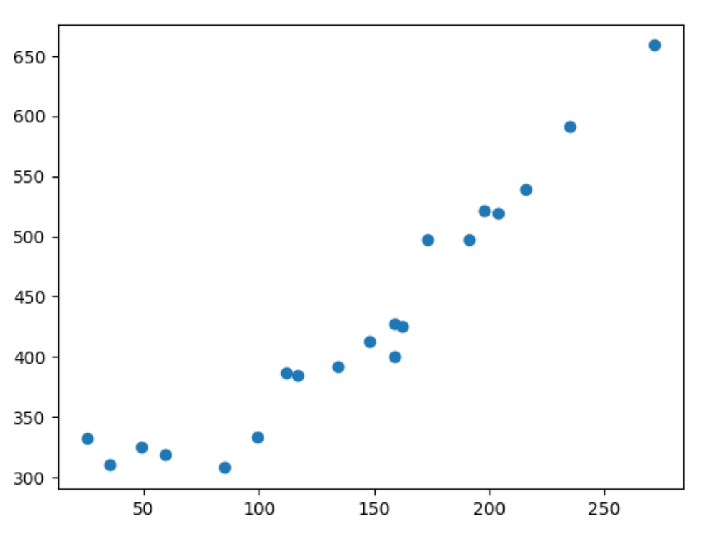
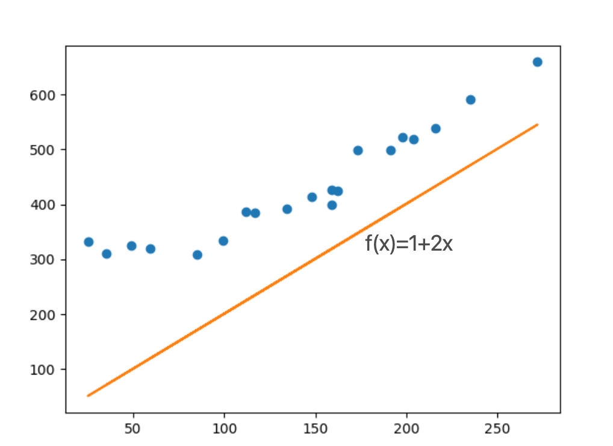
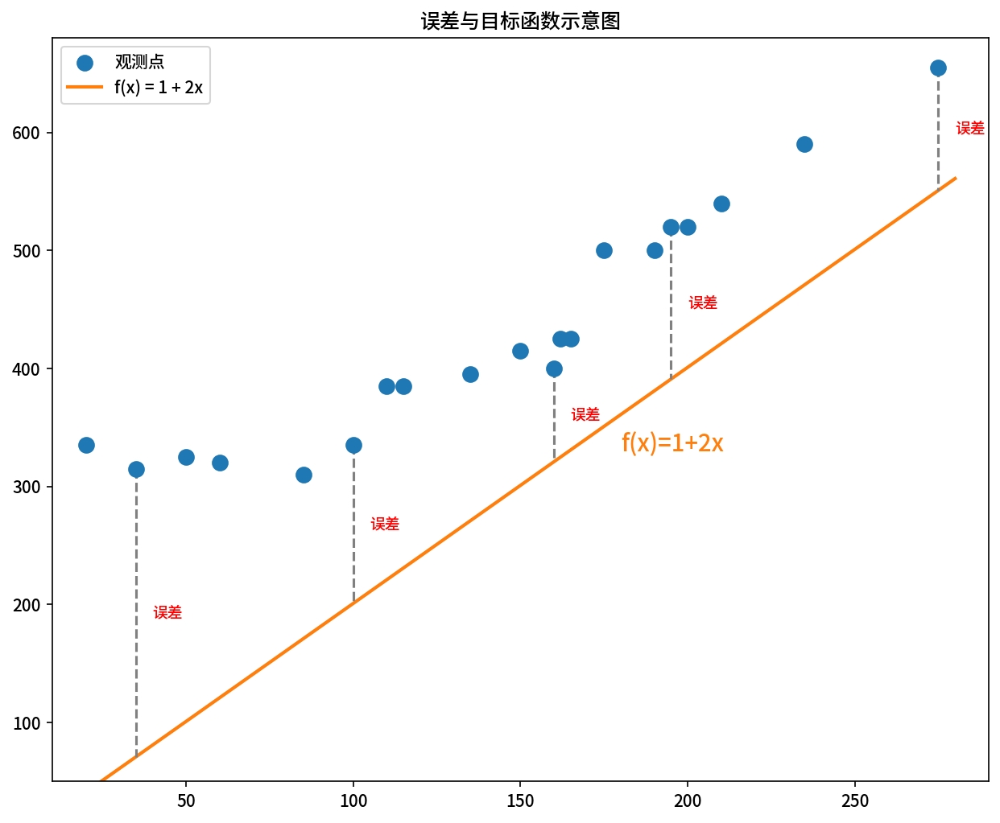

# 机器学习基础知识

# 机器学习算法适用范围
* 回归：处理连续数据例如时间序列数据。
* 分类：带分类标签的数据如邮件归类为垃圾邮件的数据，这类数据也称为正确答案数据，使用这类数据训练叫做有监督学习，回归和分类都是有监督学习。
* 聚类：没有数据标签的数据是聚类数据，通过无标签数据进行学习叫无监督学习。

# 回归
## 定义模型
y=ax+b 其中 a是斜率，b是截距。  
也可以写成：  
yθ(x)=θ₀+θ₁x 其中θ叫“西塔”，再统计学表示未知数和推测值，也叫做参数。
## 训练数据
### 数据
````csv
x,y
235,591
216,539
148,413
35,310
85,308
204,519
49,325
25,332
173,498
191,498
134,392
99,334
117,385
112,387
162,425
272,659
159,400
159,427
59,319
198,522
````
### 绘图
训练数据绘图结果


### 目标函数（误差之和）
假设函数表达为yθ(x)=1+2x，如图：

假设的θ₀（1）和θ₁（2）距离训练数据是有误差的：

假设函数和训练数据之间误差之和成为目标函数E(θ) ：
$$
E(\theta) = \frac{1}{2} \sum_{i=1}^{n} \left( y^{(i)} - f_{\theta}(x^{(i)}) \right)^2
$$
(∑叫做西格玛)  
对每个训练数据的误差取平方之和后全部相加（均方误差 MSE），然后乘以二分之一。  
我们的目的就是找到使E(θ)的值最小的θ，这样的问题成为最小化问题。


# 数学符号
````text
+ - × ÷ ± = ≠ ≈ ≡ ≤ ≥ < > ≪ ≫ ¬ ∧ ∨ ⊕ ⊗
∈ ∉ ⊂ ⊃ ⊆ ⊇ ∪ ∩ ∅ ∀ ∃ ∄ ∴ ∵ → ← ↔ ⇒ ⇐ ⇔ ↦
∫ ∬ ∭ ∮ ∯ ∰ ∂ ∇ √ ∛ ∜ ∞ ∝ ∑ ∏ ∐ ′ ″ ‴
α β γ δ ε ζ η θ ι κ λ μ ν ξ π ρ σ τ υ φ χ ψ ω
Α Β Γ Δ Ε Ζ Η Θ Ι Κ Λ Μ Ν Ξ Π Ρ Σ Τ Υ Φ Χ Ψ Ω
( ) [ ] { } ⟨ ⟩ | ‖ ⌈ ⌉ ⌊ ⌋ ¯ ¸ · …
⁰ ¹ ² ³ ⁴ ⁵ ⁶ ⁷ ⁸ ⁹ ⁺ ⁻ ⁼ ⁽ ⁾ ⁿ
₀ ₁ ₂ ₃ ₄ ₅ ₆ ₇ ₈ ₉ ₊ ₋ ₌ ₍ ₎
π ℯ ℎ ℏ ℑ ℜ ℘ ℓ №
````