# 安装OpenClaw-Mac宿主-Multipass虚拟机--飞书频道
在Mac环境下用Multipass虚拟机安装OpenClaw并配置飞书机器人

## 下载安装Multipass
根据宿主机操作系统下载并安装Multipass软件：  
安装地址:[https://canonical.com/multipass/install](https://canonical.com/multipass/install)

## 创建虚拟机
在镜像（images）页面选择Ubuntu 24.04 LTS版本点击配置按钮：  
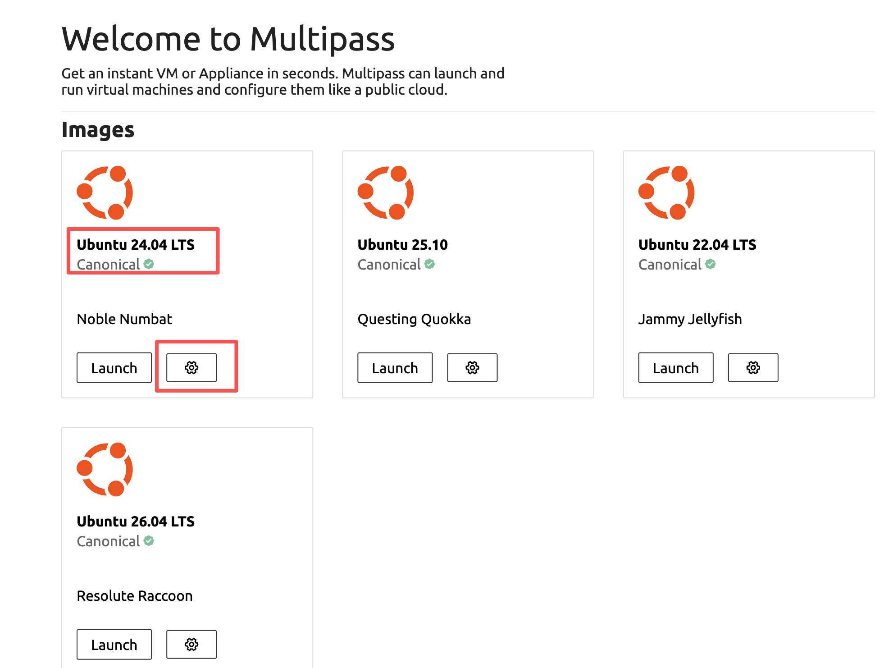  
虚拟机名称：open-claw；CPU2个；内存4G；硬盘20G；点击Launch & Configure next按钮：    
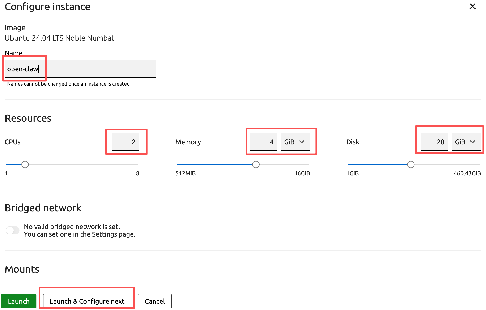

## 配置虚拟机
虚拟机创建完成之后进行初步配置：  
````shell
# 查看虚拟机信息 下面显示虚拟机IP是192.168.2.4
multipass list

Name                    State             IPv4             Image
open-claw               Running           192.168.2.4      Ubuntu 24.04 LTS

# 登录虚拟机
multipass shell open-claw

# 更新系统安装常用工具
sudo apt update && sudo apt upgrade -y
sudo apt install htop wget  telnet net-tools ntpdate git curl vim -y

# 强制更新和同步时间（时间不对后面会报错）
sudo ntpdate pool.ntp.org
sudo timedatectl set-ntp true
````

## 用SSH公钥登录虚拟机
因为Multipass虚拟机不知道登录密码，后面安装完成之后需要用宿主机端口转发到虚拟机才能浏览Open Claw控制台界面，所以这步需要手动同步SSH登录公钥：  
第一步回到宿主机Mac环境创建或复制SSH公钥，打开一个新的终端窗口：  
````shell
# 如果没有SSH公私钥则执行下面的命令并一路回车完成(Email改成自己的)，否则跳过这步不用执行
ssh-keygen -t rsa -b 4096 -C "sunweisheng@live.cn"
````
第二步：复制SSH登录公钥到剪切板：  
````shell
# 查看公钥信息并复制（Command+C）
cat ~/.ssh/id_rsa.pub

# 复制显出出来的信息（从头到Email全部）
ssh-rsa AAAAB3NzaC1yc2EAAAADAQABAAACAQC.....7OwKw== sunweisheng@live.cn
````
第三步：将宿主机SSH公钥添加到虚拟机中  
````shell
echo "<你刚刚复制的公钥内容>" >> ~/.ssh/authorized_keys
````
第四步：试验用SSH公私钥从宿主机登录到虚拟机
````shell
# 从宿主机的终端执行,如果能登录成功就OK了，首次链接要打一个yes
ssh ubuntu@192.168.2.4
````

## 创建飞书机器人
打开 [飞书开发平台](https://open.feishu.cn/?lang=zh-CN)，创建应用添加机器人能力，记录好APP ID和App Secret（后面会用到），然后将所有im:开头并不需要审核的权限赋予机器人，再配置事件选择长链接（这里需要等Open claw安装完之后才能保存长链接），添加消息与群组事件，最后点击发布版本即可。  
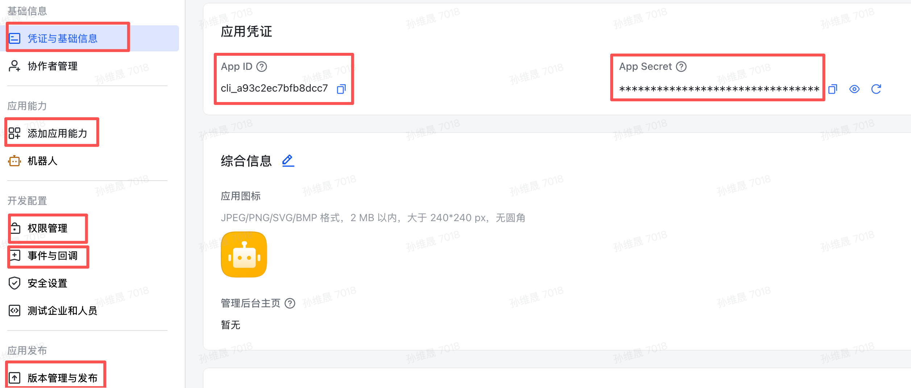
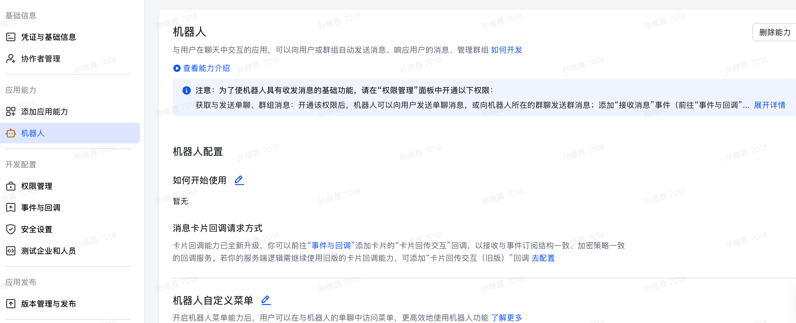
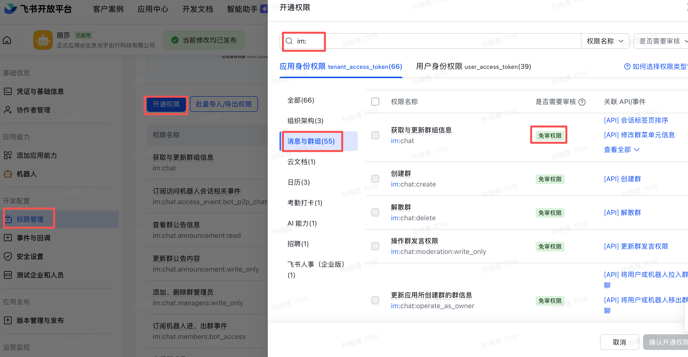
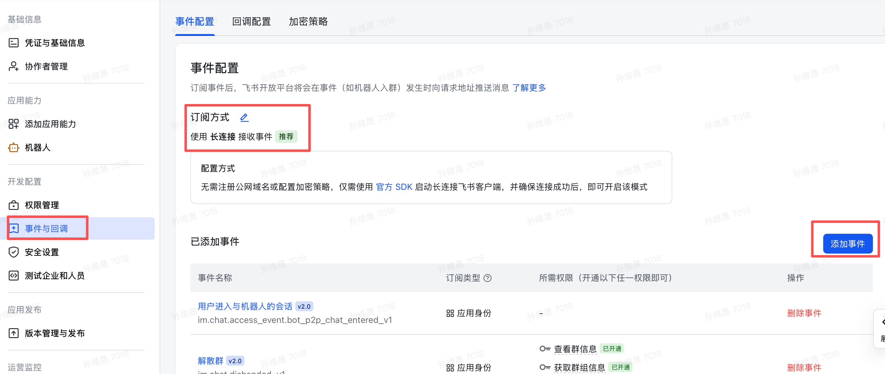
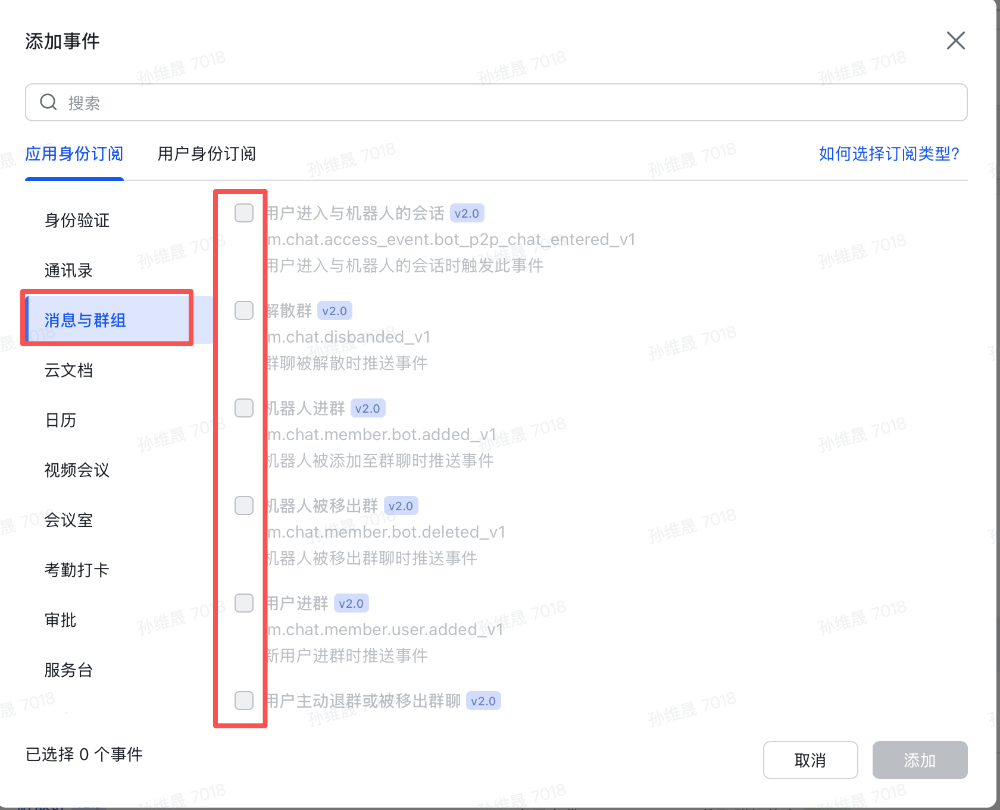
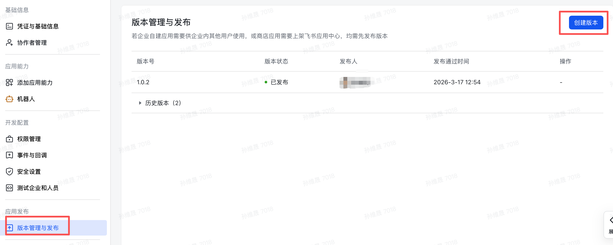

## 注册KIMI开发平台账号和Tavily账号
打开 [KIMI开放平台](https://platform.moonshot.cn) 注册账号之后创建API KEY，记住这个KEY后面会用到。  
打开 [Tavily](https://www.tavily.com) 注册账号之后复制API Key也是后面要用到。  

## 安装Open Claw
````shell
# 打开一个终端登录虚拟机
ssh ubuntu@192.168.2.4

# 下载并安装 nvm：（如果出错误多试几次因为国内链接GitHub网络不好）
curl -o- https://raw.githubusercontent.com/nvm-sh/nvm/v0.40.3/install.sh | bash

# 代替重启 shell
\. "$HOME/.nvm/nvm.sh"

# 下载并安装 Node.js：
nvm install 24

# 验证 Node.js 版本：
node -v # Should print "v24.14.0".

# 验证 npm 版本：
npm -v # Should print "11.9.0".

# GIT用SSH否则后面会报错
git config --global url."https://github.com/".insteadOf "ssh://git@github.com/"

# 开始安装Open Claw
npm install -g openclaw@latest

# 出现以下类似信息就说明安装成功了
npm warn deprecated node-domexception@1.0.0: Use your platform's native DOMException instead

added 539 packages in 10m

89 packages are looking for funding
  run `npm fund` for details
npm notice
npm notice New minor version of npm available! 11.9.0 -> 11.11.1
npm notice Changelog: https://github.com/npm/cli/releases/tag/v11.11.1
npm notice To update run: npm install -g npm@11.11.1
npm notice

# 重新登录一下，遇到过一次环境变量里有/r或/n导致之后安装网关不成功
# 退出
exit
# 重新登录（目的是重新加载一次环境变量）
ssh ubuntu@192.168.2.4

## 配置Open Claw
openclaw onboard --install-daemon

# 选择Yes
◆  I understand this is personal-by-default and shared/multi-user use requires lock-down. Continue?
│  ● Yes / ○ No

# 选择QuickStart
◆  Onboarding mode
│  ● QuickStart (Configure details later via openclaw configure.)
│  ○ Manual

# 选择KIMI
◆  Model/auth provider
│  ○ OpenAI
│  ○ Anthropic
│  ○ Chutes
│  ○ MiniMax
│  ● Moonshot AI (Kimi K2.5) (Kimi K2.5 + Kimi Coding)
│  ○ Google
│  ○ xAI (Grok)
│  ○ Mistral AI
│  ○ Volcano Engine
│  ○ BytePlus
│  ○ OpenRouter

# 选择.cn
◆  Moonshot AI (Kimi K2.5) auth method
│  ○ Kimi API key (.ai)
│  ● Kimi API key (.cn)
│  ○ Kimi Code API key (subscription)
│  ○ Back

# 输入KIMI的API KEY
◆  How do you want to provide this API key?
│  ● Paste API key now (Stores the key directly in OpenClaw config)
│  ○ Use external secret provider

# 选择Keep current 
◆  Default model
│  ● Keep current (moonshot/kimi-k2.5)
│  ○ Enter model manually
│  ○ moonshot/kimi-k2.5

# 选择飞书
Select channel (QuickStart)
│  ○ Telegram (Bot API)
│  ○ WhatsApp (QR link)
│  ○ Discord (Bot API)
│  ○ IRC (Server + Nick)
│  ○ Google Chat (Chat API)
│  ○ Slack (Socket Mode)
│  ○ Signal (signal-cli)
│  ○ iMessage (imsg)
│  ○ LINE (Messaging API)
│  ● Feishu/Lark (飞书) (plugin · install)
│  ○ Nostr (NIP-04 DMs)
│  ○ Microsoft Teams (Bot Framework)
│  ○ Mattermost (plugin)

# 选择安装插件
◆  Install Feishu plugin?
│  ○ Download from npm (@openclaw/feishu)
│  ● Use local plugin path 
│  (/home/ubuntu/.nvm/versions/node/v24.14.0/lib/node_modules/openclaw/extensions/feishu)
│  ○ Skip for now

# 输入飞书应用的密钥
◆  How do you want to provide this App Secret?
│  ● Enter App Secret (Stores the credential directly in OpenClaw config)
│  ○ Use external secret provider

# 输入飞书应用的APP ID
◆  Enter Feishu App ID
│  _

# 选择WebSocket
◆  Feishu connection mode
│  ● WebSocket (default)
│  ○ Webhook

# 选择国内飞书
◆  Which Feishu domain?
│  ● Feishu (feishu.cn) - China
│  ○ Lark (larksuite.com) - International

# 第一个是必须是特定飞书组才能使用机器人（需要提供飞书分组ID），第二个是都可以，第三个是不回应任何组内消息，以后也能改先选择都可以通讯
◆  Group chat policy
│  ○ Allowlist - only respond in specific groups
│  ● Open - respond in all groups (requires mention)
│  ○ Disabled - don't respond in groups

# 都用不了跳过吧
◆  Search provider
│  ○ Brave Search
│  ○ Gemini (Google Search)
│  ○ Grok (xAI)
│  ○ Kimi (Moonshot)
│  ○ Perplexity Search
│  ● Skip for now 

# 以后再说
◆  Configure skills now? (recommended)
│  ○ Yes / ● No

# 选择最后两个（用空格选择）
◆  Enable hooks?
│  ◻ Skip for now
│  ◻ 🚀 boot-md
│  ◻ 📎 bootstrap-extra-files
│  ◼ 📝 command-logger (Log all command events to a centralized audit file)
│  ◼ 💾 session-memory (Save session context to memory when /new or /reset command is issued)

# 选择最后一个，一会儿在浏览器进入控制台
◆  How do you want to hatch your bot?
│  ○ Hatch in TUI (recommended)
│  ○ Open the Web UI
│  ● Do this later
└
# 之后比较重要的是这段信息
◇  Control UI ─────────────────────────────────────────────────────────────────────╮
│                                                                                  │
│  Web UI: http://127.0.0.1:18789/                                                 │
│  Web UI (with token):                                                            │
│  http://127.0.0.1:18789/#token=cc54ce4aa9ced390d7286bb4c904e3b9bddf34303132b312  │
│  Gateway WS: ws://127.0.0.1:18789                                                │
│  Gateway: reachable                                                              │
│  Docs: https://docs.openclaw.ai/web/control-ui                                   │
│                                                                                  │
├──────────────────────────────────────────────────────────────────────────────────╯
````
其中http://127.0.0.1:18789/#token=cc54ce4aa9ced390d7286bb4c904e3b9bddf34303132b312
就是控制台的进入地址和密码记好了。  

````shell
# 虚拟机是192.168.2.4执行以下命令才能在宿主机电脑上打开，新打开一个控制台执行
ssh -N -L 18789:127.0.0.1:18789 ubuntu@192.168.2.4
````
执行之后打开一个浏览器，在地址栏输入：http://127.0.0.1:18789/#token=cc54ce4aa9ced390d7286bb4c904e3b9bddf34303132b312
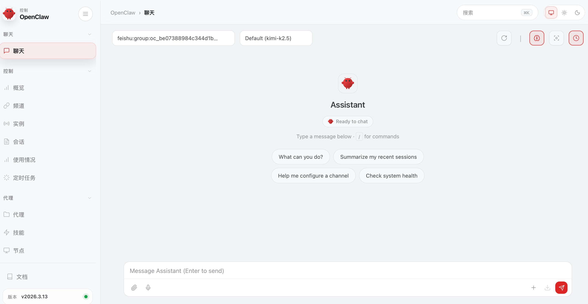  
可以在对话框里和Open Claw对话，初次对话你需要设置Open Claw的灵魂（就是人设）:  
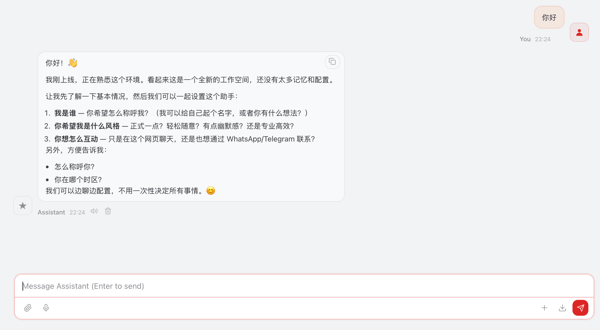  
你可以让TA帮你编写一个网页搜索信息的工具，用在Tavily注册得到的Key，比如你跟他说：“我有Tavily的Key帮我编写一个网页信息搜索的工具，并搜索一下今天科技信息的热门话题。”，TA在编写工具的时候会跟你要KEY你在聊天对话框里发给TA就行了。
几秒钟工具就写好了，并用这个工具给你返回了结果：
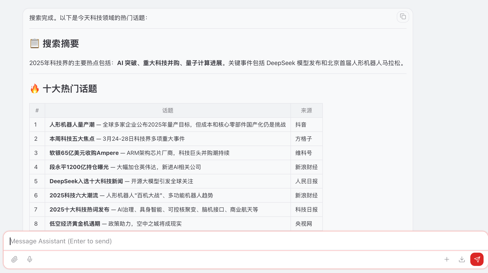  
现在你可以回到[飞书开发平台](https://open.feishu.cn/?lang=zh-CN)，在事件订阅方式中配置长链接并保存，再重新发布一个机器人版本，发布成功之后你就可以在飞书中将机器人和你加到一个群里，你@机器人，机器人就会回答你：
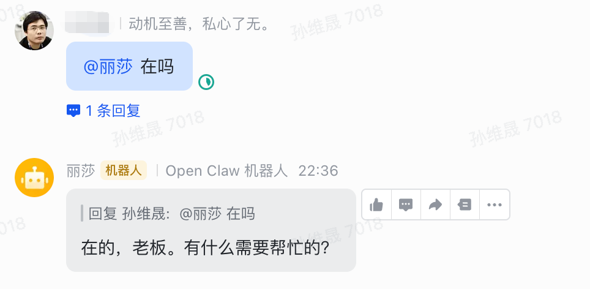  
目前Open Claw基础配置都完成了，你可以探索更有趣的使用方法。